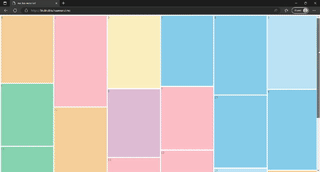
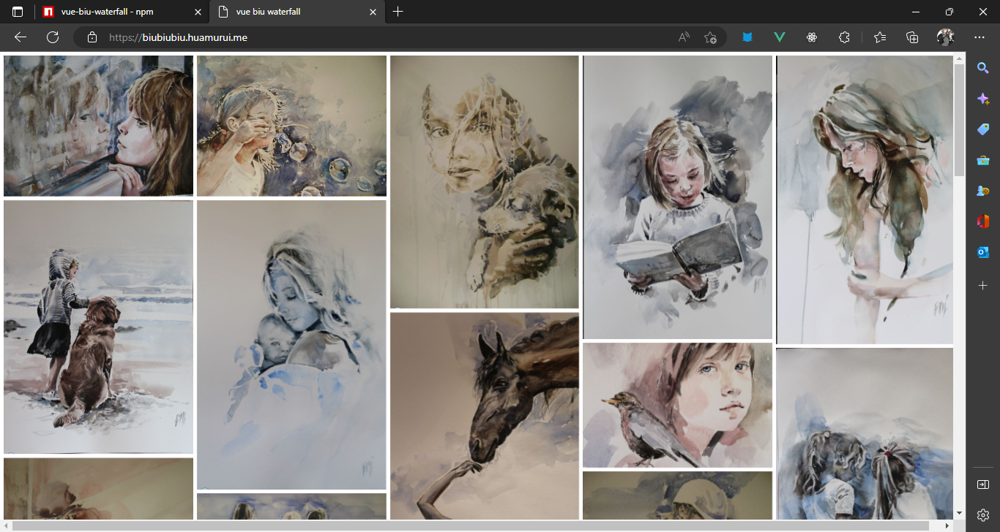

# A waterfall layout based on vue3 and typescript(still in developing now)

[](https://www.npmjs.com/package/vue-biu-waterfall)
[](LICENSE)

...and, this repository is inspired by following  two repositories [myst729/Waterfall](https://github.com/myst729/Waterfall),  [MopTym/vue-waterfall](https://github.com/MopTym/vue-waterfall)

~~ps:you know what? I want to call this biuterfall(biu-waterfall->biuterfall,and similar to beautiful)~~

## Demo

### [biu~](http://biubiubiu.huamurui.me)  <---click here to see it




## Installation

```shell
npm install --save vue-biu-waterfall
```

### Import

#### vue3 + setup + ts

```ts
import { WaterfallConfig, WaterfallCell } from 'vue-biu-waterfall/lib'

// these two are for ... 

let items = ...

const reflow= ...
const reflowed = ...
```

### template structure

```html
    <WaterfallConfig  @scrollToBottom="reflow" @allThingDone="reflowed">
      <WaterfallCell :waterCell="item" v-for="item in items" :key="item.index">
        <div>
           <!-- {{ item.lalala }}  -->
           <!-- and you can put more things in this div, such as ...... -->
        </div>
      </WaterfallCell>
    </WaterfallConfig>

```

## Props

### waterfallConfig

Name | Default | Description
---- | ---- | ----
line-gap | ---- | Required. The standard space (px) between lines.
min-line-gap | ---- | The minimal space between lines.
max-line-gap | --- | The maximal space between lines.
single-max-width | --- |The maximal width of slot which is single in horizontal direction.
watch | ---- | Watch something, reflow when it changes.
interval | ---- | The minimal time interval (ms) between reflow actions.

these props are for computing a layout,I have given a suitable [default config](./lib/WaterfallConfig.vue), but you can check [this function](./lib/utils/calculate.ts) to know how it works exactly, and try out your own config.

### waterfallCell

Name | Default | Description
---- | ---- | ----
item | ---- | item
item.index | ---- | Required
item.width | ---- | Required
item.height | ---- | Required
item.style | ---- | ----
item.url | ---- | ----
item.content | ---- | ----
'[keyName: string]: any '| ---- | ----

Here we directly pass the object into waterfallCell, but the object should have flowing features:
index, height, width. These three are needed to computed the rect to display and can't be empty, the style, url, content could be empty, I give it here to make it convenient to store and use the features you may want in template, and if you don't like these names...  '[keyName: string]: any', define it yourself is also ok.

## Transition

## Events

### @scrollToBottom

This is a event for lazy-load, you can call a function to add items when this event was triggered.

### @allThingDone

This is a event for preventing the excessive requests(such as too much scroll) smash the machine, you can use it with a lock variable to protect the program. And you can use many other way help to implement debouncing and throttling.

## Reactivity

## License

Released under the [MIT](LICENSE) License.
